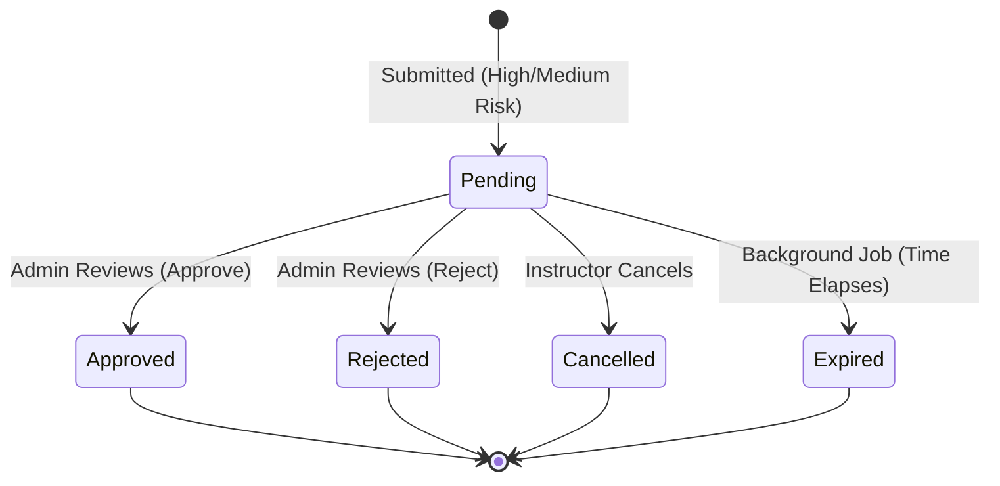

# Data Model: course-features

## Entities

### `CourseEditRequest` (New Table: `course_edit_requests`)

Tracks requests made by instructors to modify published courses.

| Field | Type | Attributes | Description |
|-------|------|------------|-------------|
| `Id` | `Guid` | Primary Key | Unique identifier |
| `CourseId` | `Guid` | Foreign Key, Required | Links to the `Course` being edited |
| `RequestedBy` | `Guid` | Foreign Key, Required | Links to the `User` (Instructor) who requested the edit |
| `RequestType` | `Enum` | Required | `Section` (0), `SectionItem` (1), or `CourseProperty` (2) |
| `TargetSectionId` | `Guid?` | Nullable | Target section being edited (if applicable) |
| `TargetItemId` | `Guid?` | Nullable | Target section item being edited (if applicable) |
| `Operation` | `Enum` | Required | `Create` (0), `Update` (1), or `Delete` (2) |
| `JsonPayload` | `string?` | Nullable | Serialized JSON containing new properties (e.g. `SectionEditPayload`) |
| `Status` | `Enum` | Required, Default: `Pending`| `Pending` (0), `Approved` (1), `Rejected` (2), `Cancelled` (3), `Expired` (4) |
| `AdminNotes` | `string?` | MaxLength(1000) | Notes left by the admin when reviewing |
| `ReviewedAt` | `DateTime?` | Nullable | Timestamp of the admin review |
| `ReviewedBy` | `Guid?` | Foreign Key, Nullable | Links to the `User` (Admin) who performed the review |
| `IsEmergency` | `bool` | Default: `false` | Indicates a critical edit (e.g. price change > 50%) |
| `ExpiresAt` | `DateTime?` | Nullable | Timestamp when the request auto-expires if not reviewed |
| `RequestedAt` | `DateTime` | Required | Automatically populated by `BaseEntity` or explicitly set |

**Relationships**:
- Many-to-One with `Course`
- Many-to-One with `User` (RequestedByUser)
- Many-to-One with `User` (ReviewedByUser)

**Indexes**:
- `IX_CourseEditRequests_CourseId_Status` on `(CourseId, Status)`
- `IX_CourseEditRequests_RequestedAt` on `(RequestedAt)`
- `IX_CourseEditRequests_IsEmergency` on `(IsEmergency) WHERE IsEmergency = 1`

---

### `Course` (Existing Entity Updates)

Added fields to track versioning and content updates.

| Field | Type | Attributes | Description |
|-------|------|------------|-------------|
| `Version` | `int` | Default: 1 | Increments each time a course edit request is approved or content changes significantly. |
| `LastContentUpdateAt` | `DateTime?` | Nullable | Tracks when the learning content (sections/items) was last modified. |

---

### `CourseLog` (Existing Entity Updates)

**Enum: `CourseLogAction` Additions**:
- `EditRequestSubmitted`
- `EditRequestApproved`
- `EditRequestRejected`
- `EditRequestCancelled`

**Indexes**:
- `IX_CourseLogs_CourseId_Timestamp` on `(CourseId, Timestamp DESC)` for fast timeline queries.

## State Transitions

### `CourseEditRequest` Status

